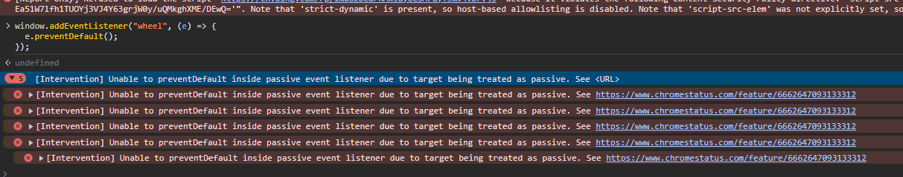
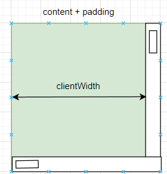
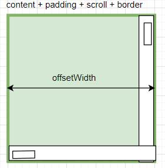
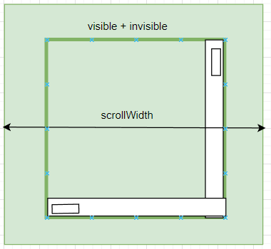
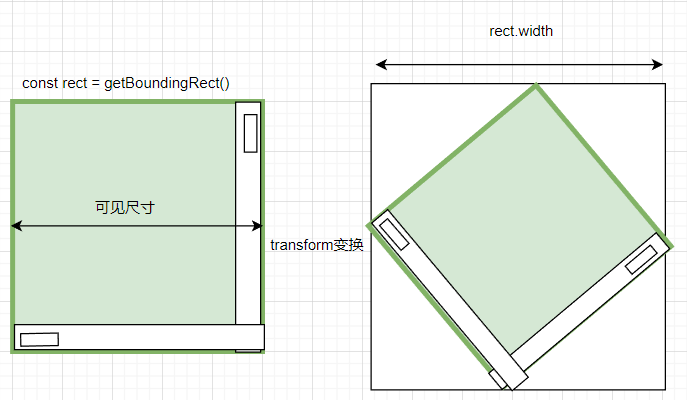
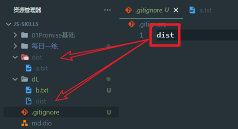
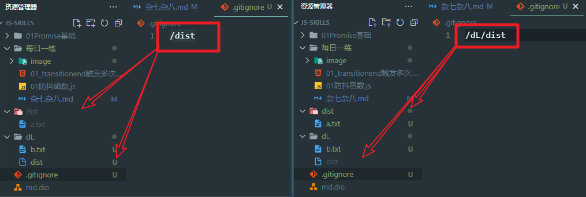
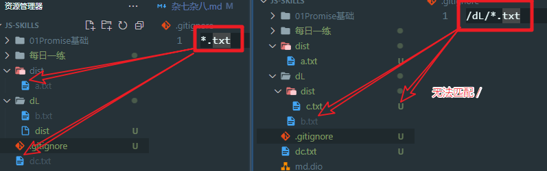

### 无法取消的默认行为

> 阻止了浏览器的滚动 (wheel) 默认行为，不生效，并且报错了

```js
window.addEventListener("wheel", (e) => {
  e.preventDefault();
});
```



分析：

> 浏览器会对很多东西做优化，但是有一个前提，就是用户不会阻止它的默认行为。不然就会报以上的问题。
>
> 此时只要给 addEventListener 配置 ***第三个参数 { passive: false } 相当于告诉浏览器我会阻止默认行为，不用给我做优化了***

```js
window.addEventListener("wheel", (e) => {
   e.preventDefault();
}, { passive: false });
```

补充：addEventListener 的第三个参数

> `addEventListener(type, listener, useCapture);`
>
> `addEventListener(type, listener, options);`
>
> 第三个参数分俩中情况：
>
> * 一个boolean useCaptrue，表示是以 **捕获** 还是 ***冒泡*** 方式触发事件（true or false，默认是冒泡 false）
> * 一个对象 options
>   * ***captrue* **：事件在捕获阶段触发（true)
>   * ***once* **：事件最多触发一次（true）
>   * ***passive* **：表示事件不会被阻止默认行为（true）
>   * ***signal* **：[`AbortSignal`](https://developer.mozilla.org/zh-CN/docs/Web/API/AbortSignal)，该 `AbortSignal` 的 [`abort()`](https://developer.mozilla.org/zh-CN/docs/Web/API/AbortController/abort "abort()") 方法被调用时，监听器会被移除。

### JS中计时器是否准确？为什么？

> 1. 硬件：世界上没有完全准确的计时技术，现有技术来看相对比较准确的是原子钟，但是用户日常使用的设备并不带有原子钟
> 2. 系统：我们前端计时都是交给操作系统来实现的，不同的操作系统计时会有差异
> 3. 标准：w3c标准说若计时器定时器嵌套超过4层会产生一个4ms的误差
> 4. 事件循环：计时的回调不是计时结束就立即执行了，而是要等到任务队列清空后，才会执行

### 元素的尺寸

获取元素尺寸的一些方案：

* getComputedStyle(dom).width

  从元素的 CSSOM树 上获取信息，结果可能并不准确
* clientWidth

  
* offsetWidth

  
* scrollWidth

  > 从Layout tree 上获取信息，是被溢出隐藏的整个内容区域的信息
  >

  
* dom.getBoundingClientRect()

  > 绘制前一步 GPU 处理过程中获得的 dom信息，元素的transform变换也被考虑在内
  >

  

## CSS中的vmin和vmax单位

> 场景：移动端中，全屏展示一张图片并且不出现滚动条（图片宽高取视口最短边，另一条边等比适应)
>
> vmin：取视口最短的边；  vmax：取视口最长边

```css


img {
  width: vmin;
  height: vmin;
}
```

## 关于高亮关键字的设计思路

## gitignore匹配规则

* 一个单词 dist

  > 排除整个目录结构中（***根目录下***或嵌套在***其他文件夹下***）的 ***dist文件或文件夹***
  >

  
* 带有 / ：/dist 或 /a/dist 或 dist/

  > 从当前gitignore出发 排除当 ***前目录*** 中的dist 或 当目录的 ***a文件*** 夹下的dist
  >

  > 斜杠在末尾 表示排除的 ***一定是文件夹*** 反之就是文件夹+文件
  >

  
* 星号

  > *.[后缀] 匹配不包括 / 的任意字符(0个或多个字符)
  >

  > 若要匹配 dL 下所有深度的 txt 文件：/dL/  **  / **. txt*
  >

  
* 问号

  > ?.[后缀] ***匹配单个字符*** 其他用法和星号一样
  >
* 中括号

  > [0-9].[后缀] ***匹配单个字符***，可对这个字符做一些 ***约束*** ，用法和星号一样
  >
* 要将一个空文件夹传上去

  > ! 在之前配置的条件下 忽略某文件
  >

  
